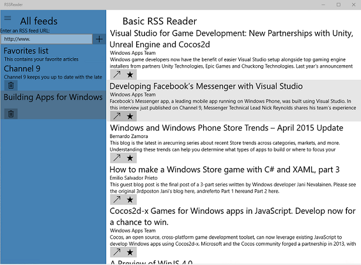

# RSSReader sample

**RSSReader** is a sample Universal Windows Platform (UWP) app for retrieving RSS feeds and viewing articles. Users can specify the URL of a feed, launch articles for viewing in the browser, and save favorite articles to local storage. It is designed to run on multiple form factors and uses an MVVM architecture.  

## Features

**Note:** Features in this app are subject to change.

RSSReader demonstrates:
	
* Use of the Syndication APIs (Windows.Web.Syndication) to retrieve an RSS feed.
* Use of the DataContractSerializer  class (System.Runtime.Serialization.DataContractSerializer) to save and restore app data from local storage.
* The XAML SplitView control along with AdaptiveTriggers to create an app that works well for multiple screen sizes.
* C# and XAML using the MVVM design pattern.

## Running the sample

The default project is RSSReader and you can Start Debugging (F5) or Start Without Debugging (Ctrl+F5) to try it out. The app will run in the emulator or on physical devices. 

**Note:** This sample assumes you have an internet connection. It also requires Visual Studio 2015 RC and the associated Windows 10 developer tools. The platform target currently defaults to ARM, so be sure to change that to x64 or x86 if you want to test on a non-ARM device. 

## Code at a glance

If you’re just interested in code snippets for certain API and don’t want to browse or run the full sample, check out the following files for examples of some highlighted features:

* ViewModel/FeedsArticlesViewModel.cs:
	- The view model contains the majority of the core functionality of the app (state and behavior), including the implementations of the view Commands, use of the syndication API, and use of the serialization API.
* View/FeedsArticlesView.xaml and FeedsArticlesView.xaml.cs
	- The XAML view and associated code behind that contains all of the visuals for the app. It demonstrates basic usage of adaptive triggers with the XAML SplitView control to create an interface that works well across screen sizes.
* Model/RssArticleModel.cs and RssFeedModel.cs
	- The models are the core data objects for storing RSS feeds and their associated articles. 
* Common/BindableBase.cs and DelegateCommand.cs:
	- MVVM helper classes
	- Inherit from BindableBase to make your class observable (that is, give it an implementation of INotifyPropertyChanged)
	- Expose a property of type DelegateCommand on your class to implement the command design pattern (an implementation of ICommand)